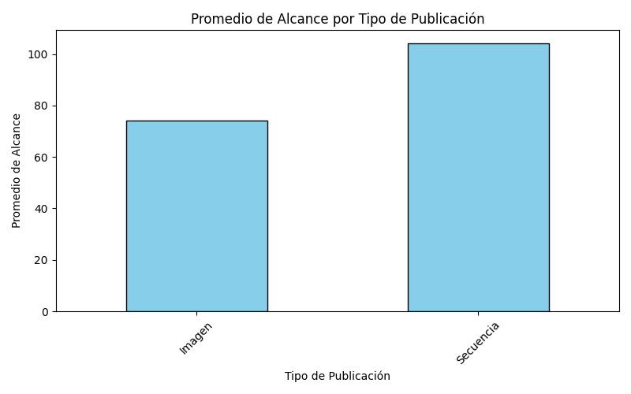
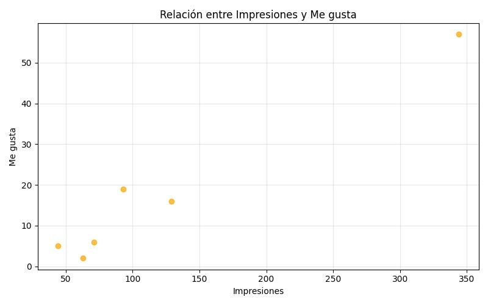
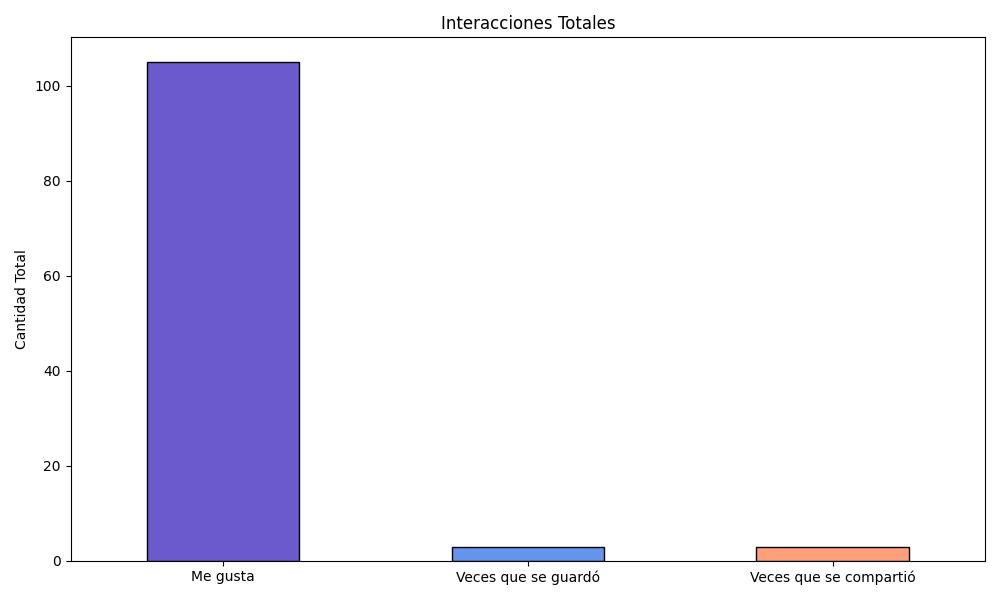

## Análisis de Datos en Redes Sociales - DeliZone

### Descripción del Proyecto

El objetivo de este proyecto es analizar y comprender los efectos de las interacciones de las publicaciones de las redes sociales en este caso Instagram de el sitio web DeliZone, utilizando Python para el procesamiento y análisis de datos. Las métricas de Instagram se utilizarán para mejorar la toma de decisiones estratégicas con el fin de tener mas publico y adquirir nuevos clientes.

### Datos Disponibles

El proyecto trabajará con los siguientes conjuntos de datos:
1. Publicaciones
- Métricas clave:
    Impresiones: Número total de veces que se mostró la publicación.
    Alcance: Número de usuarios únicos que vieron la publicación.
    Me gusta: Cantidad de interacciones en las publicaciones.
    Compartidos: Número de veces que se compartió la publicación.
    Guardados: Número de veces que los usuarios guardaron la publicación.
2. Publico
- Datos relacionados con la cuenta de Instagram:
    Total de seguidores: Número total de usuarios que siguen la cuenta.
    Distribución por sexo y edad: Segmentación demográfica de los seguidores.
    Ubicación geográfica: Principales ciudades y países donde se encuentran los seguidores.
3. Engagement Diario
- Información sobre las interacciones y el crecimiento de la cuenta:
    Seguidores adquiridos por fecha: Número de seguidores ganados día a día.
    Visitas al perfil por fecha: Total de visitas al perfil de Instagram por día.
    
### Estructura del Proyecto

```
Proyecto-Analisis-DeliZone/
│
├── api/
│   └── api.py         # Api de FastAPI app
│
├── data/
│   └── publicaciones.csv
│   └── publico.csv
│
├── etl/
│   └── etl_proceso.ipynb
│   └── etl_proceso.py
│
├── graficos/           # Resultados visuales de los análisis
│
├── ml/
│   └── arboles.py
│   └── bayes.py
│
├── viz/
│   └── visualizaciones.py
│
├── main.py 
│
├── README.md            # Documentación del proyecto
├── requirements.txt     # Dependencias necesarias
```

## Proceso ETL de las Publicaciones

### Descripción General

Este proceso ETL (Extract, Transform, Load) tiene como objetivo extraer los datos de un archivo CSV en este caso haremos el proceso para las publicaciones de la cuenta de Instagram de *DeliZone*

1. El proceso comienza obteniendo la ubicación del archivo CSV publicaciones.csv, que se encuentra en la carpeta data. Se utiliza la función os.path para construir la ruta de manera flexible, asegurando que funcione correctamente en diferentes entornos.

```
# Extracción de los datos

# Importamos las librerias necesarias
import pandas as pd
import os

# Cargamos los datos
base_path = os.path.dirname(os.path.abspath(__file__))
data_path = os.path.join(base_path, '..', 'data', 'publicaciones.csv')
df_origin = pd.read_csv(data_path)
df = df_origin.copy()
```

2. Visualización de los Datos:
Se visualiza el DataFrame df para tener una vista preliminar de los datos.
Se utiliza df.info() para obtener información detallada sobre los tipos de datos de cada columna, lo que ayuda a identificar posibles inconsistencias o datos no esperados.

```
# Mostramos los datos de las publicaciones
df

# Tipos de dato por columna
df.info()
```

3. Eliminación de Columnas Innecesarias:
Se define una lista COLUMNS_TO_DROP con los nombres de las columnas que no se necesitan para el análisis posterior.
La función df.drop() elimina estas columnas del DataFrame, dejando solo las columnas que serán relevantes para el análisis.

```
# Eliminación de columnas que no necesitamos
COLUMNS_TO_DROP = [
'Identificador de la cuenta',
'Nombre de usuario de la cuenta',
'Nombre de la cuenta', 'Duración (segundos)',
'Comentario sobre los datos',
'Comentarios',
'Enlace permanente',
'Fecha',
]
df = df.drop(COLUMNS_TO_DROP, axis=1)

# Mostramos el resultado
df
```

4. Extraccion de Hashtags
- Se muestra una de las descripciones de las publicaciones para observar cómo están formateados los hashtags.
- Utilizando el método str.findall(r'#\w+'), se extraen todos los hashtags presentes en la columna Descripción. Esta expresión regular busca las palabras que comienzan con el símbolo # y contienen caracteres alfanuméricos.
- Los hashtags encontrados se almacenan en una nueva columna llamada Hashtags, lo que permite tener una lista de hashtags por cada publicación.

```
# Separación de Hashtags de la descripción
# Mostramos una de las descripciones para obtener la información completa
df.iloc[0]['Descripción']
```

```
# Ahora obtenemos únicamente los numerales de todas las descripciones
df['Descripción'].str.findall('#')
```

```
# Ahora obtenemos los Hashtags completos
df['Descripción'].str.findall(r'#\w+') # findall nos sirve para buscar partes de un string en específico
```

```
# Ahora creamos separamos los hashtags de la descripción
df['Hashtags'] = df['Descripción'].str.findall(r'#\w+')
```

```
# Mostramos los datos
df
```
## Gráficos Generados
Se presentan las visualizaciones creadas para analizar las métricas de las publicaciones:

### Explicación corta del codigo que se utiliza para crear los graficos

- plt.figure(figsize=(8, 5)): Crea una nueva figura con un tamaño específico.
- tipo_publicacion_alcance.sort_values().plot(kind='bar', ...): Ordena los valores y genera un gráfico de barras.
- plt.title(), plt.xlabel(), plt.ylabel(): Añade un título y etiquetas a los ejes.
- plt.xticks(rotation=45): Rota las etiquetas del eje X para mejor visibilidad.
- plt.tight_layout(): Ajusta el diseño para evitar solapamientos.
- plt.show(): Muestra el gráfico en pantalla.
- plt.savefig(...): Guarda la figura en un archivo PNG.
- plt.close(): Cierra el gráfico para liberar recursos.

### Alcance por Tipo de Publicación
Este gráfico de barras muestra el promedio de alcance para cada tipo de publicación (por ejemplo, imágenes, secuencias, etc.). Nos ayuda a identificar qué formato funciona mejor en términos de alcance.

Datos:
- Tipo de publicación
- Alcance

```
# Guardamos ambas columnas
tipo_publicacion_alcance = data.groupby("Tipo de publicación")["Alcance"].mean()

# Creamos el grafico
plt.figure(figsize=(8, 5))
tipo_publicacion_alcance.sort_values().plot(kind='bar', color='skyblue', edgecolor='black')
plt.title("Promedio de Alcance por Tipo de Publicación")
plt.xlabel("Tipo de Publicación")
plt.ylabel("Promedio de Alcance")
plt.xticks(rotation=45)
plt.tight_layout()
plt.show()

# Guardamos la grafica en una imagen
plt.savefig("../graficos/promedio_alcance_tipo_publicacion.png")
plt.close()
```


## Relación entre Impresiones y Me gusta
Este gráfico muestra cómo se relacionan las impresiones con los "me gusta". Ayuda a identificar si más impresiones resultan en más "me gusta".
Datos utilizados:
- Impresiones
- Me gusta

```
# Crear el gráfico de dispersión
plt.figure(figsize=(8, 5))
plt.scatter(data["Impresiones"], data["Me gusta"], color='orange', alpha=0.7)
plt.title("Relación entre Impresiones y Me gusta")
plt.xlabel("Impresiones")
plt.ylabel("Me gusta")
plt.grid(alpha=0.3)
plt.tight_layout()
plt.show()

# Guardamos la grafica en una imagen
plt.savefig("../graficos/relacion_impresiones_megusta.png")
plt.close()
```


## Total de interacciones de las publicaciones
Este gráfico muestra las interacciones de todas las publicaciones, incluyendo "me gusta", "guardado" y "compartido". Muestra una visión general de las métricas mas importantes de interacción.
Datos:
- Me gusta
- Veces que se guardó
- Veces que se compartió

```
interacciones = data[["Me gusta", "Veces que se guardó", "Veces que se compartió"]].sum()

# Crearmos el grafico
plt.figure(figsize=(10, 6))
interacciones.plot(kind="bar", color=["#6A5ACD", "#6495ED", "#FFA07A"], edgecolor="black")
plt.title("Interacciones Totales")
plt.ylabel("Cantidad Total")
plt.xticks(rotation=0)
plt.tight_layout()
plt.show()

# Guardamos la grafica en una imagen
plt.savefig("../graficos/interacciones_totales.png")
plt.close()
```


## Próximos pasos
- Integrar modelos de machine learning para predecir el alcance de futuras publicaciones.
- Automatizar el proceso ETL para facilitar el manejo de datos.

## Guía de Uso de la API de DeliZone
La API de DeliZone está diseñada para permitir la interacción con el proyecto de análisis de datos y generación de modelos. A continuación, se detallan los pasos necesarios para usar la API.

1. Iniciar la API

Para ejecutar la API, sigue estos pasos:
- Asegúrate de tener las dependencias necesarias:
- Si no has instalado las dependencias, puedes hacerlo usando el archivo requirements.txt de tu proyecto. Ejecuta el siguiente comando:
```
pip install -r requirements.txt
```

2. Ejecutar el archivo main.py:
El archivo main.py es el punto de entrada para la API. En la raíz del proyecto, ejecuta el siguiente comando para iniciar el servidor de la API:
```
python main.py
```

3. Acceder a la documentación automática:
FastAPI genera una documentación para realizar la prueba de la API. Accede a la siguiente URL en tu navegador:
```
http://localhost:8000/docs
```

## Ejemplo de Uso con URL
Usar URL:

Si prefieres probar los endpoints desde la línea de comandos con URL, aquí tienes ejemplos de cómo hacerlo.
1. jecutar el proceso ETL:

curl http://localhost:8000/run_etl

2. Generar gráfico:

curl http://localhost:8000/run_dataviz/1 <-- Puedes poner 1 de los 3 graficos que se mostraron con anterioridad.

3. Ejecutar modelo de árboles de decisión: (Aun sin terminar) 

curl http://localhost:8000/ml/arboles

4. Ejecutar modelo de Naive Bayes: (Aun sin terminar) 

curl http://localhost:8000/ml/bayes